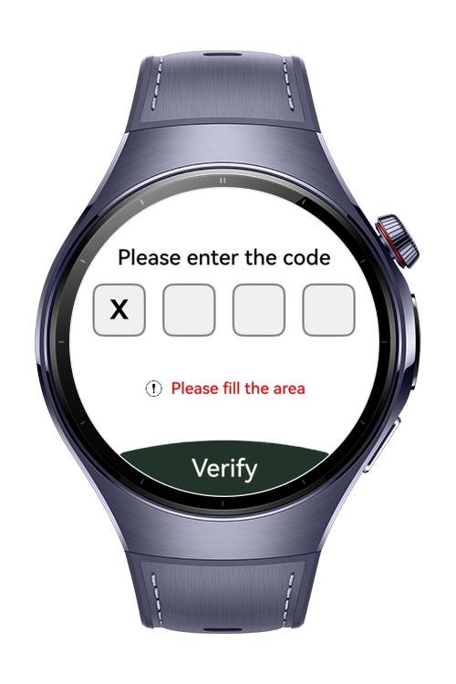
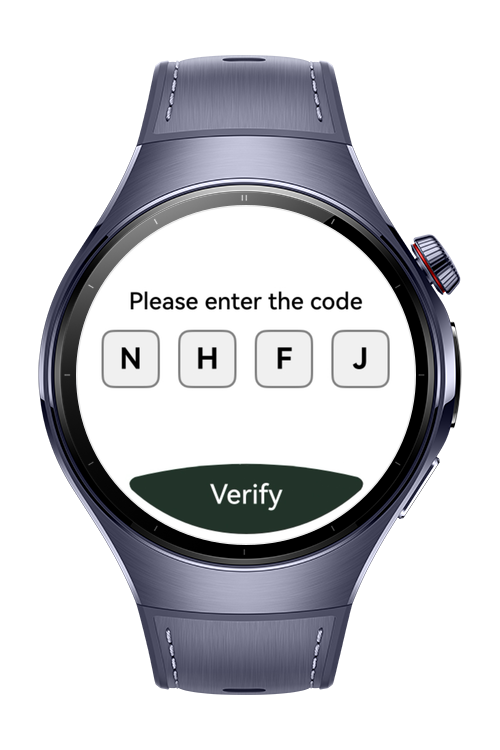

> **Note:** To access all shared projects, get information about environment setup, and view other guides, please visit [Explore-In-HMOS-Wearable Index](https://github.com/Explore-In-HMOS-Wearable/hmos-index).

# PinInputFormField

This component aims to securely receive a 4-digit code from the user. To optimize the user experience, while the PIN entry boxes (Box components) provide visual feedback, the actual keyboard input is managed via an invisible (opacity: 0) TextInput component. This allows the user to input the code in a single flow using the keyboard, instead of tapping each box, with the entered characters immediately reflected in the boxes.# Preview

<div>
    
    
    
</div>


# Use Cases

This PIN verification screen is typically used in mobile or wearable applications that require fast and critical verification steps, such as the following:

- Quick Access Unlock: Entering the user-defined PIN before accessing sensitive in-app information (e.g., wallet balances).

- Transaction Confirmation: Performing a final verification step before executing a payment or authorization transaction.


# Tech Stack


- Languages: ArkTS (Ark TypeScript)

- Frameworks: Requires **DevEco Studio** (e.g. version 5.1.0.842)

- Tools: Requires **DevEco Studio** (e.g. version 5.1.0.842).

- Libraries & Kits:

- `@kit.ArkUI`


# Directory Structure

```
entry/src/main/ets/
ets/
├── entryability/
│   └── EntryAbility.ets
│
├── entrybackupability/
│   └── EntryBackupAbility.ets
│
├── pages/
│   ├── Index.ets
├── common/
│   └── Constants.ets
├── utils/
│   └── Logger.ets
│ 
│
resources/


```

# Constraints and Restrictions

## Supported Device
- Huawei Watch 5

# License

PinInputFormField is distributed under the terms of the MIT License
See the [LICENSE](./LICENSE) for more information.


